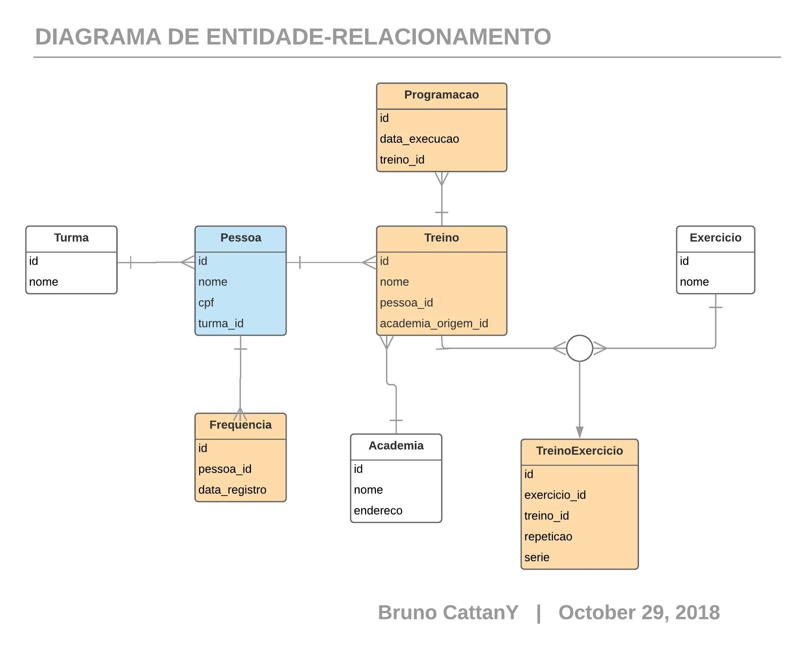
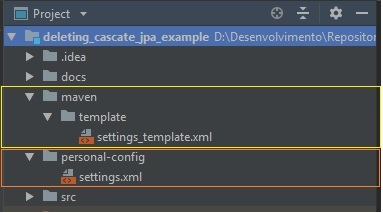
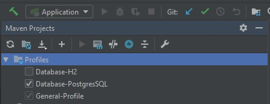
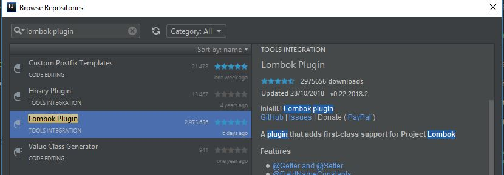
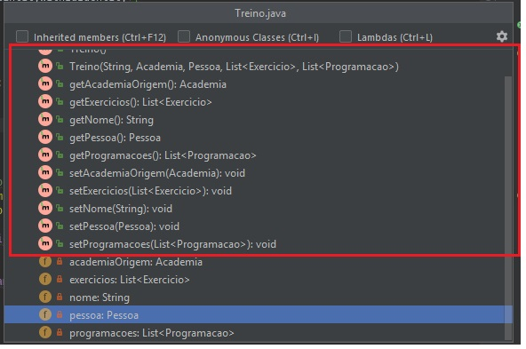

# Deleting-cascade-jpa

## Sumário:

- ### a) Categoria
- ### b) Motivação
- ### c) Resumo
   * ### c1) Requisitos
   * ### c2) Efeitos previstos
- ### d) Informações do projeto
- ### e) Como configurar

---

### a) Categoria: 

**Estudo** - JPA/Hibernate

---

### b) Motivação: 

Entender o efeito prático do uso do **_'CascadeType.REMOVE' (since JPA 1.0)_**\
e também o uso do parâmetro **_'orphanRemoval = true' (since JPA 2.0)_**.

---

### c) Resumo:

Foi declarado o _**Cascade**_ somente nos relacionamentos **_@OneToMany_**.\
Para demonstração na prática, foi adotado/modelado o seguinte cenário:

#### c1) Requisitos:

- 1 - **Excluir** uma pessoa do sistema.
  * Isto implica excluir **todas as dependências** do mesmo.

#### c2) Efeitos Previstos:

Quando **uma pessoa** for excluída, todas as tabelas que se encontram em laranja do diagrama\
**(Frequencia, Treino, Programacao e Treino Exercicio)** serão afetadas.

---

### d) Informações do projeto:

1. **Java 8**

2. **Spring Boot - 2.0.6.RELEASE:**
   1. **starter-data-jpa**
   2. **spring-boot-starter-data-rest**
   3. **spring-boot-devtools**
   4. **spring-boot-starter-test**

3. **Lombok - (Utilitário)**

4. **Postgresql or H2 - (Databases)**

---

### e) Como configurar:

1. Acessar o arquivo **maven/template/settings_template.xml (referência amarela)** 
e realizar uma cópia deste arquivo para o diretório 
**personal-config** _(referência vermlha - Você deve criar este diretório, exatamente com este nome, na raíz do projeto)_.   
**O nome do arquivo copiado, é conforme _a sua preferência_.**

> Obs.: Isso se deve ao fato de que no **.gitignore** deste projeto, este diretório será ignorado,
 possibiliando que possa se manusear no arquivo de configuração sem que o _**GIT**_ 
 fique interpretando as mudanças do mesmo. Entretanto, esta abordagem é opcional!

2. Escolher qual dos bancos disponíveis deseja utilizar **(PostgreSQL ou H2)** e configurá-lo.\
Também configure o local do seu **repositório local do Maven**.\
Caso utilize o diretório _**.m2**_ (padrão do Maven), apenas retire a tag **_localRepository_**.

3. Ativar o profile de sua preferência antes de subir o projeto.

4. Como este projeto utiliza-se da biblioteca [Lombok](https://projectlombok.org/), é necessário instalar o plugin do mesmo, para se visualizar **os métodos/campos/etc. autogerados**. Veja como é no **IntelliJ**:

- **Browse plugins in IntelliJ:**

- **Lombok Plugin:**

5. Pronto! Contanto que você tenha colocado alguma porta não conflituosa **(recomendado 8080)**, suba o projeto e estude!
